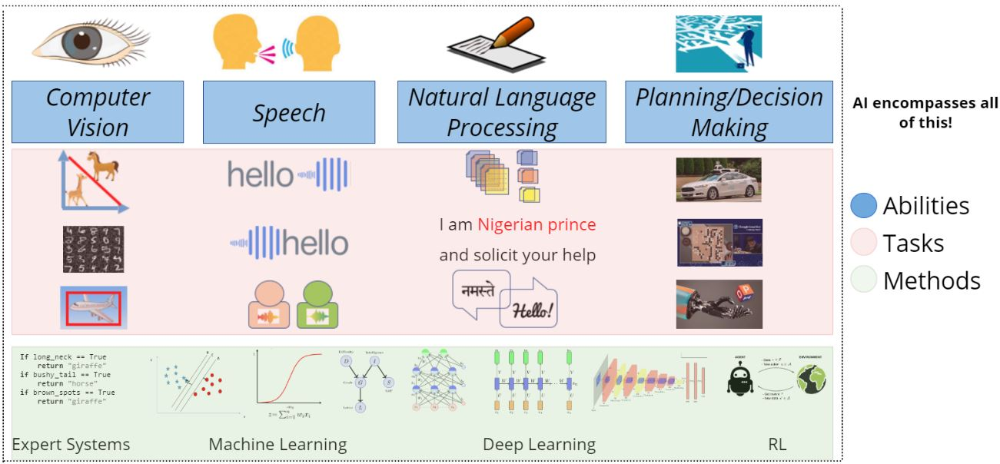
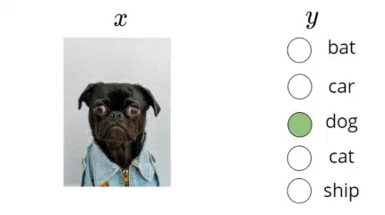
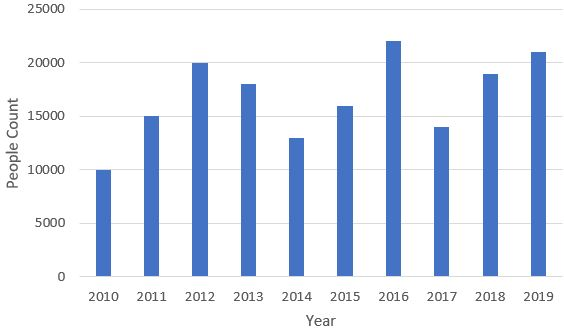
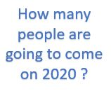

# Busting Jagron for AI

```A lot of confusing terms are around us all the time, specially if a new person is trying to get into this field of Data.

By the End of this Article you'll be able to classify things happening around in a better fashion as Artificial Intelligence, Machine Learning, Deep Learning, Deep Reinforcement Learning, Computer Vision, Data Science, Pattern Recognition and so on.
```

---

## What is the Jagron Bubble floating around in AI ?

All of us have come along these definitions where people quote Data Science, Artificial Intelligence, Deep Learning, Machine Learning etc normally and we get confused by what the person really means.

For example
  1. Courses on **Data Science** and **Artificial Intelligence**
  2. Introduction to **Pattern Recognition** and **Machine Learning**
  3. **Deep Learning** for **Natural Language Processing**
  4. **Image Processing** for **Computer Vision**
  5. Deep **Reinforcement Learning**
  
  
After hearing these terms one with another let's jump to some of the definitions and try to see if it helps to clear this jargon.

### Artificial Intelligence (AI)
sometimes called machine intelligence, is intelligence demonstrated by machines, in contrast to the natural intelligence displayed by humans and other animals.


### Machine Learning
is a field of computer science that uses <span style="color:red">_statistical techniques_</span> to give computer systems the ability to <span style="color:red">_"learn"_</span> with <span style="color:red">_data_</span>, and <span style="color:red">_without being explicitly programmed_</span>.


### Data Science
is an <span style="color:red">_interdisciplinary_</span> field that uses <span style="color:red">_scientific methods, processes, algorithms_</span> and systems to extract <span style="color:red">_knowledge_</span> and insights from data in various forms, <span style="color:red">_both structured and unstructured_</span>,  similar to data mining.


### Pattern Recognition
is the automated <span style="color:red">_recognition of patterns_</span> and regularities <span style="color:red">_in data_</span>.


### Computer Vision
is an <span style="color:red">_interdisciplinary field_</span> that deals with how computers can be made to gain <span style="color:red">_high-level understanding_</span> from digital <span style="color:red">_images or videos_</span> and <span style="color:red">_automate tasks that the human visual system_</span> can do.


### Deep Learning
is a new area of <span style="color:red">_Machine Learning research_</span>, which has been introduced with the objective of moving Machine Learning closer to one of its original goals: <span style="color:blueviolet">_Artificial Intelligence_</span>.


Now after reading so many definitions are you clear with the meaning ? or still confused ?
Talking about me I am confused !
- Does AI not involve stastical techniques, data, learning ?
- Is it AI only if it is explicitly programmed ?
- Is AI/ML not interdisciplinary, or don't they deal with structured data, or scientific methods ?
- Recognition of Patterns isn't similar to _Intelligence_, _insights from data_, _learn from data_ ?


## Bursting the Bubble

Let's solve this problem with an alternate approach and split everything to 3 categories
- Abilities
- Task
- Methods

### Abilities
  1. Seeing (Computer Vision)
  2. Speaking and Hearing (Speech)
  3. Reading and Writing (Natural Language Processing)
  4. Making Decisions (Reinforcement Learning)
  

### Tasks
#### Computer Vision
  - Classifying two or more animals using there demographics. 
  - Recognizing handwritten digits. 
  - Detecting an object in an image like, Coffee, Phone, Glasses etc.
  

  
#### Speech
  - Retieving back something heard.
  - Converting this article to speech.
  - Hearing two different people speaking and able to distinguish between voices.


  
### Natural Processing Language
  - Classifying a spam or ham emails.
  - Translating something written from Hindi to English or vice-versa.
  

  
### Reinforcement Learning
  - The most common example we know is _Autonomous Driving_.
  - Alpha GO.
  - Teaching a robot to lift things according to their weight.
  


  
  
### Methods
 - All the abbove tasks can be solved with Expert Systems, Logistic Regression, SVM, Graph Methods, Recurrent Neural Networks(RNN), Convolutional Neural Networks(CNN) and many more.


## So What is AI ?
AI encompasses all of this i.e. Abilities, Tasks, Methods.



## Taking a deeper dive into Machine Learning

If I give the following data to the model and I get an Expert System program in return, as the machine itself creates some logics and rules to come at this conclusion. This is an example of Supervised Learning. Most of the Machine Learning is comprised of Supervised Learning only.




### Most AI Tasks Require Pattern Recognition...

**How is Pattern Recognition Different ?**
  The field of Pattern Recognition is concerned with the automatic discovery of regularities in data through the use of computer algorithm and with the use of these regularities take actions such as <span style="color:Red">Classification, Regression, CLustering etc.</span>
  
  
### Is Image Processing different from Computer Vision ?
  There is a small difference between Computer Vision and Image Processing. Computer Vision may uses a processed input image as it's input. For example if the input image is of irregular sizes to the model and the CV model only takes input size of 128x128 images, Then the images have to be resized and then sent to model.
  Doing that transformation is called Image Processing.
  
### What is Data Science ?
  What if I give you a data and after plotting it looks like the following bar plot, and ask you to tell me the amount of people going to come by next year i.e. 2020 ?
  
  
  
  
  So, I would prefer the term Data Science when we are dealing with Numerical Data ( like database tables, Sales, Customers, Revenue etc).
  
  
  
  
  
  
  
## Conclusion

So by the end of the article, I expect you to be clear with what is AI, ML, PR etc. And will use the terms appropriately.


## References

I would like to refer One Fourth Labs Lecture on youtube named "Jagron Busting".
You can find the video link at the following URL : https://www.youtube.com/watch?v=OMGt-jcMlCs
